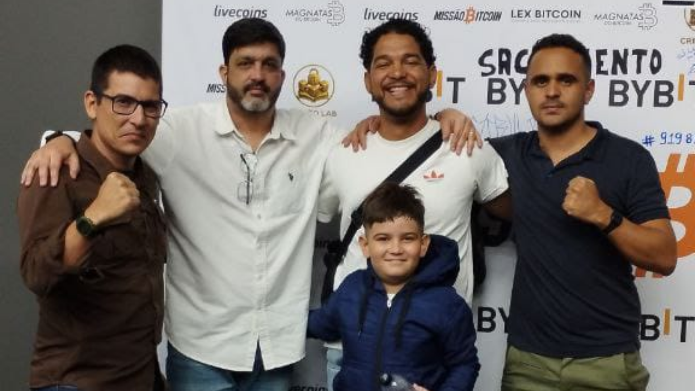
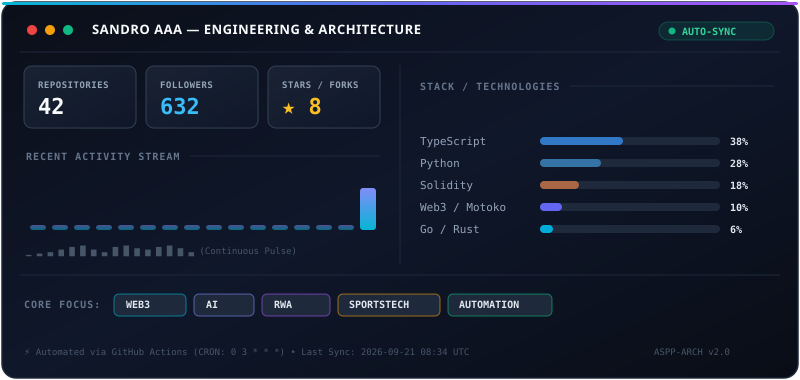

# Olá, eu sou o Sandro! 👋 | Hi, I'm Sandro! 🚀 

### 🇧🇷 Cofundador ASPPIBRA-DAO | Arquiteto Web3 | Líder de Impacto Social
### 🇺🇸 Co-founder at ASPPIBRA-DAO | Web3 Architect | Social Impact Leader

---

## 🚀 Visão Geral | Overview
Sou um empreendedor e desenvolvedor focado em unir o **Agronegócio**, **Blockchain** e **Políticas Públicas**. Minha missão é transformar a economia real através da tecnologia, criando soluções de **RWA (Real World Assets)** e governança descentralizada.

- 🏗️ **Foco Atual:** Incubação de startups e tokenização de ativos no ecossistema **Mundo Digital**.
- 📍 **Projeto Paraty Integrado:** Liderando a digitalização e regularização agroecológica em Paraty-RJ (ASPPIBRA).
- 🦈 **Shark Tank Brasil:** Projeto submetido e documentação apresentada para expansão de impacto em 2026.

---

## 🛠 Tecnologias & Stacks | Tech Stack

### 🔗 Web3 & Infraestrutura

### 💻 Linguagens & Frameworks

---

## 📸 Networking & Eventos | Networking & Events

  
   
  <em>Networking no evento <b>Missão Bitcoin</b> com referências do ecossistema Web3.</em>

---

## 📊 Métricas de Engenharia & Telemetria | Live Engineering Dashboard

  

---

## 🏆 Projetos de Destaque | Featured Projects

  

---

## 📱 Contato Direto | Direct Contact

*"Tecnologia a serviço da liberdade e do desenvolvimento real."*
